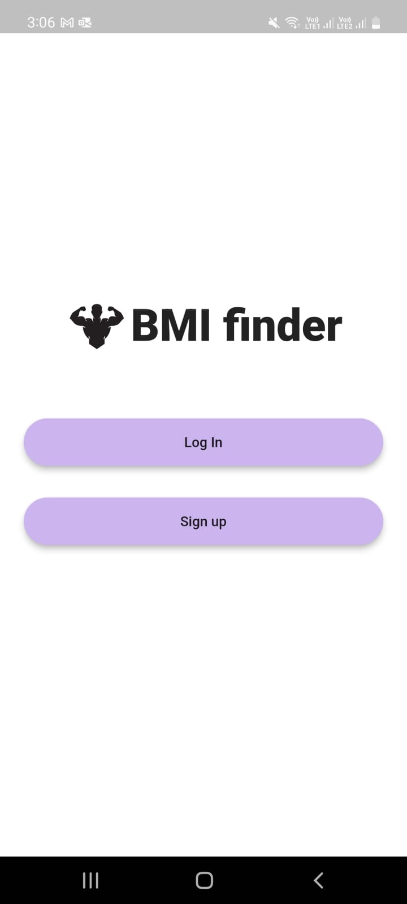
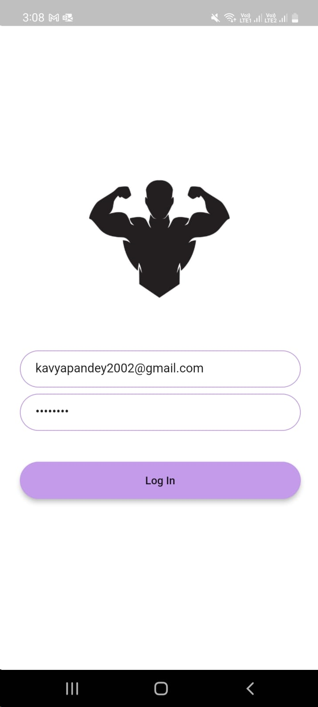
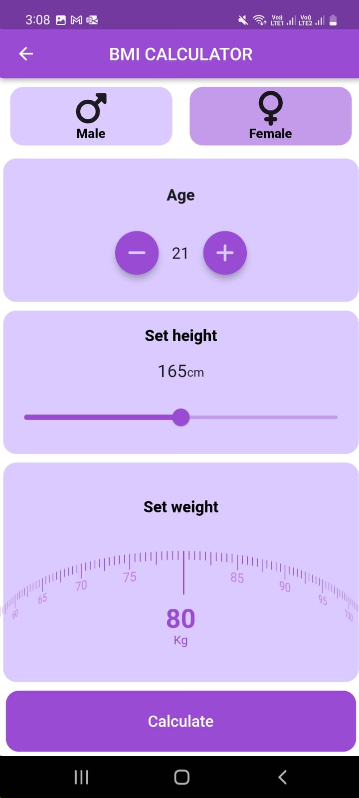
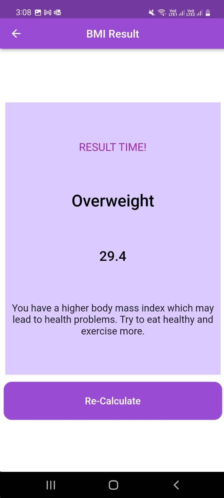

# BMI Calc app

An app to calculate BMI on the parameters of age, height and weight of an individual.

Tools used
Firebase authentication: User sign in and login functionality

Language used
Dart / Flutter

# Some images of the app

  

  